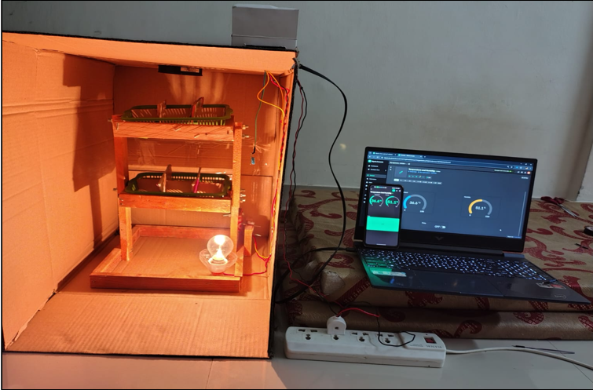
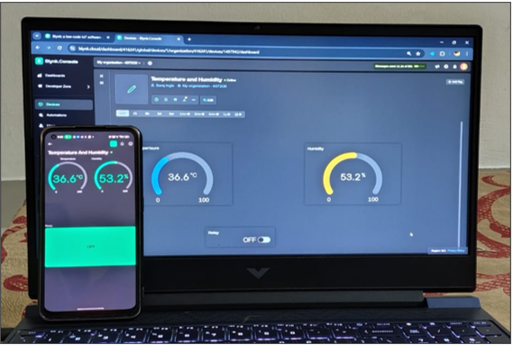
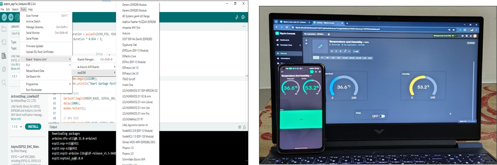

# 🥚 IoT Based Smart Egg Incubator

An **IoT-enabled Smart Egg Incubator system** designed to automatically monitor and control the **temperature and humidity** required for egg hatching.
The system ensures optimal environmental conditions using **sensors, microcontrollers, and IoT connectivity**, improving hatch success rates and reducing manual effort.

---

# 🚀 Project Overview

The **Smart Egg Incubator** automates the egg incubation process by continuously monitoring environmental parameters and adjusting them in real time.

Using **IoT technology**, the system allows users to remotely monitor temperature and humidity through an **IoT dashboard or mobile application**.

This project demonstrates the integration of **IoT hardware, sensors, and embedded programming** to build a practical real-world automation system.

---

# 🌡️ Monitoring & Control Features

## 📊 Real-Time Monitoring

* Continuous **temperature monitoring**
* Continuous **humidity monitoring**
* Live data visualization on **IoT dashboard**
* Real-time sensor updates

## ⚙️ Automatic Environmental Control

* **Automatic heater activation** when temperature drops
* **Ventilation fan control**
* **Humidity regulation** for proper incubation

## 📱 Remote Monitoring

* Monitor incubator conditions from **mobile or web interface**
* Real-time updates via **WiFi enabled microcontroller**
* Easy access to incubation status

---

# 🔔 Smart Alerts

* Alerts when **temperature exceeds safe limits**
* Alerts when **humidity drops below required levels**
* Notifications about **system activity and status**

---

# 🧰 Hardware Components

* **NodeMCU (ESP8266)** – WiFi enabled microcontroller
* **DHT11 / DHT22 Sensor** – Temperature & humidity sensing
* **Relay Module** – Controls heater and fan
* **Heating Element / Bulb** – Maintains temperature
* **Cooling Fan** – Air circulation
* **Power Supply**
* **Incubator Box**

---

# 💻 Software & Technologies

## Programming

* Arduino IDE
* Embedded C / Arduino C++

## IoT Communication

* WiFi using **ESP8266**

## IoT Dashboard

* Blynk / Custom Web Dashboard

## Monitoring

* Real-time sensor data visualization

---

# ⚙️ System Architecture

Sensor data is collected from **DHT sensors**, processed by **NodeMCU**, and sent to the **IoT dashboard via WiFi**.
Based on the sensor readings, the microcontroller automatically controls the **heater and fan using relay modules**.

```
DHT Sensor → NodeMCU (ESP8266) → WiFi → IoT Dashboard
                        ↓
                  Relay Module
                   ↓        ↓
                Heater     Fan
```

---

# 📸 Project Screenshots

## 🥚 Smart Egg Incubator Setup


## 🌡️ Temperature & Humidity Monitoring

## 📱 IoT Dashboard


---

# ▶️ How to Run the Project

## 1️⃣ Install Required Software

* Install **Arduino IDE**
* Install required libraries:

  * DHT Sensor Library
  * ESP8266 WiFi Library

## 2️⃣ Hardware Connections

* Connect **DHT Sensor → NodeMCU**
* Connect **Relay Module → Heater**
* Connect **Fan → Relay Module**
* Provide **Power Supply**

## 3️⃣ Upload Code

1. Open Arduino IDE
2. Select **NodeMCU (ESP8266) board**
3. Upload the incubator program

## 4️⃣ Monitor Data

* Open **IoT dashboard / Blynk**
* Monitor **temperature and humidity in real time**

---

# 📚 Learning Outcomes

* IoT system design and development
* Sensor integration and calibration
* Embedded programming using microcontrollers
* Real-time environmental monitoring
* Automation using relay-based control systems

---

# 🎯 Future Improvements

* Automatic **egg turning mechanism**
* Mobile application for full system control
* AI-based **incubation prediction**
* SMS or email alert system
* Data logging and analytics dashboard

---

# 👨‍💻 Author

**Suraj Ingle**
Bachelor of Engineering (BE) – 4rd Year
JSPM's Jayawantrao Sawant College of Engineering

---

⭐ If you like this project, consider giving it a **star on GitHub!**
